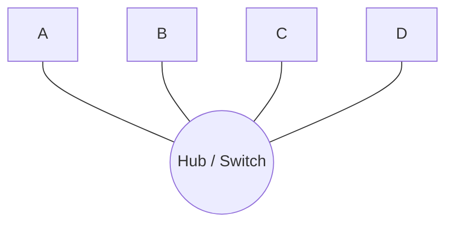
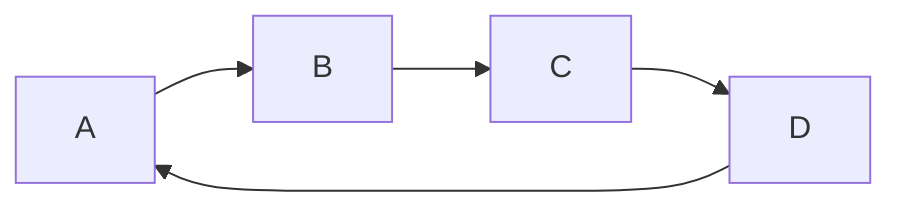
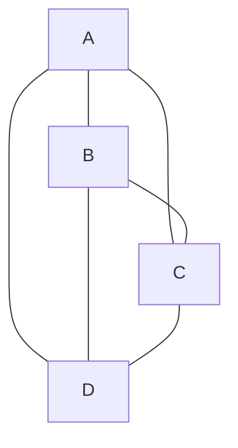

# Lesson 1: How Big Is a Network?

---

## 🧱 Fundamentals

### 🌍 Network Size

A **network’s size** can be defined by two main factors:

1. **Number of Nodes / Users**  
   - In hardware terms → *nodes or devices*.  
   - In software terms → *clients or users* (e.g., computers, phones, servers).

2. **Geographical Coverage**  
   - The physical area the network spans.

These two characteristics together determine the **network’s topology** — the structural layout of how devices are connected and how data travels among them.

---

### 🔗 Network Topologies Overview

**Topology** defines how a network is physically or logically arranged — the pattern of connections between nodes.

Topologies can be classified based on **network size** and **coverage area**:

| Type | Full Name | Description | Typical Area |
|------|------------|--------------|---------------|
| **LAN** | Local Area Network | Small area like a home, office, or campus. | Up to a few kilometers |
| **MAN** | Metropolitan Area Network | Connects multiple LANs within a city. | City-wide |
| **WAN** | Wide Area Network | Connects multiple MANs and LANs over large distances. | Country or global scale |

> 🧩 WANs are often **hybrids**, combining multiple smaller networks with different topologies (LANs, MANs, etc.).

---

### ⚙️ Network Lines and Channels

Data in networks travels through **communication lines** or **channels**.  
These can be classified into:

- **Private lines** → Dedicated connections between nodes.  
  Example: Company internal fiber lines.
- **Public/shared lines** → Used by many users simultaneously.  
  Example: The internet, cellular networks.

Each type affects **speed, cost, and security**.

---

### 🔄 System Types (Symmetrical vs. Asymmetrical)

Network systems can be categorized by how devices communicate:

1. **Symmetrical Systems**  
   - All nodes can both send and receive requests.  
   - Example: Peer-to-peer (P2P) networks — each node is equal.

2. **Asymmetrical Systems**  
   - Roles are divided: **clients** send requests, **servers** respond.  
   - Example: The web — browsers (clients) talk to servers (e.g., Google).

---

### 📡 Signal Strength and Hops

As data travels, **signal strength decays** over distance due to attenuation.  
To maintain quality:

- **Repeaters** (or **hops**) are placed to **amplify or regenerate** the signal.  
- Each “hop” extends the total distance the signal can travel reliably.

> Without hops, communication fails beyond a certain length of cable or distance.

---

## 🖧 LAN Topologies

Local Area Networks (LANs) can be physically arranged in several common topologies.  
Each affects performance, reliability, and cost.

---

### 🚌 Bus Topology

#### Structure
```text
A ---- B ---- C ---- D
```

All devices share a **single communication line (bus)** — a common cable where data flows in both directions.

#### How It Works
- Each node listens to the bus.
- When one node transmits, the signal travels along the bus to all nodes.

#### Problems
- **Collisions**: If two devices send data simultaneously, signals overlap and corrupt each other.
- **Difficult Troubleshooting**: A fault in the main cable can disable the entire network.
- **Limited scalability**: Adding devices increases collisions.

#### Collision Handling
Methods to avoid or manage collisions:
1. **Time Division Multiplexing (TDM)** – devices take turns sending data based on time slots.
2. **Frequency Division Multiplexing (FDM)** – each device transmits on a unique frequency band.
3. **Carrier Sense Multiple Access (CSMA/CD)** – used in early Ethernet; devices listen before sending.

#### Summary
✅ Simple, cheap, easy to set up.  
❌ Poor performance, collision-prone, not used in modern LANs.

---

### 🌟 Star Topology

#### Structure


All devices connect to a **central device** (Hub or Switch).

#### How It Works
- Each device has a **private link** to the central device.
- Data from one node goes to the hub → then to the intended destination.

#### Devices
- **Hub**: Broadcasts data to all devices (old technology).  
- **Switch**: Smarter — sends data *only* to the intended receiver.

#### Pros
- Easy to set up and manage.
- A single cable failure affects only one device.

#### Cons
- Hub/Switch can become a **bottleneck**.
- If the central device fails → the entire network stops.

---

### 💫 Ring Topology

#### Structure

Devices are connected in a closed loop — each with two links: one to send, one to receive.

#### How It Works
- Data travels in one direction (clockwise or counterclockwise).
- Each node receives data, checks the address, and passes it along.
- When data returns to sender, it is removed from the ring.

#### Pros
- Predictable data flow, no collisions (only one token at a time can circulate).
- Good for orderly transmission.

#### Cons
- Failure in one node or cable breaks the ring.
- Each device needs **two network cards (two IPs)**.
- Maintenance and troubleshooting are complex.

#### Improvements
- **MAU (Multi-Access Unit)** — simulates a ring but works like a central smart hub:
  - Each device has a send and receive path.
  - MAU directs signals only to the correct receiver.
  - Removes the need for multiple IPs per device.

---

### 🔺 Mesh Topology

#### Structure


Every device is directly connected to every other device.

#### Characteristics
- Highly redundant and reliable.
- Very expensive and complex (number of connections grows rapidly).

#### Formula
For *n* devices, total links = **n × (n − 1) / 2**

#### Pros
- No single point of failure.
- Extremely robust (common in backbone or high-security systems).

#### Cons
- Impractical for large networks (too many cables).
- Complex configuration.

> Mesh networks are often used **partially** (hybrid mesh) — not every device connects to every other, only key nodes.

---

## 🌐 WAN (Wide Area Network)

A **WAN** connects multiple smaller networks (LANs and MANs) across vast geographic areas — even countries or continents.

- Built using **public or private transmission lines** (fiber, satellite, leased lines).
- **No fixed topology** — often hybrid combinations (star + mesh + ring, etc.).
- Example: The **Internet** is the largest WAN.

> WANs are more about **interconnection and scalability** than strict structure.
