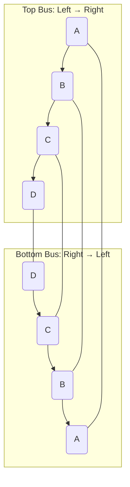
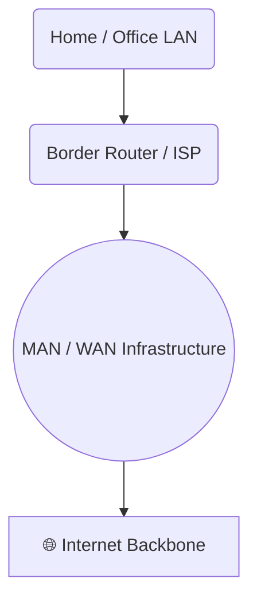

# Lesson 2: MAN & DQDB Topology 🌆

## Metropolitan Area Network (MAN)

A **MAN (Metropolitan Area Network)** connects multiple LANs across a city or large campus. It bridges small-scale LANs and wide-scale WANs.

Typical MAN technologies include **fiber optics**, **microwave links**, and **high-speed switches**.

One of the most important MAN structures is **DQDB (Distributed Queue Dual Bus)**.

---

## 🧩 DQDB — Distributed Queue Dual Bus

### 🌐 Overview

DQDB is a **dual-bus topology** used in **MANs** for high-speed data communication. It was standardized under **IEEE 802.6**.

It consists of **two unidirectional buses (fibers)** running in **opposite directions**:

Each device connects to **both buses**:

* On the **top bus**, it receives from the left and sends to the right.
* On the **bottom bus**, it receives from the right and sends to the left.

At each end of the buses:

* Left of the **top bus** → 🟢 *Empty Cell Generator 1* (creates empty cells repeatedly)
* Right of the **bottom bus** → 🟢 *Empty Cell Generator 2*

---

### ⚙️ How It Works

1. **Empty Cells Flow Continuously**
   Empty cells are generated and move along the bus. These are like *data containers waiting to be filled*.

2. **Station A (first station)** has **priority** access to the top bus since it receives empty cells first.

3. When **Station A** wants to send data:

   * It captures an empty cell.
   * Fills the **header** and **data** fields.
   * Sends it along the top bus.

4. If **Station B** (further down the line) also wants to send data but finds no empty cells (because A filled them), it sends a **request** via the **bottom bus**.

---

### 🧮 Internal Mechanism

Each station maintains two counters:

* **Request Counter (RQ)** → Number of requests *from downstream stations* waiting for access.
* **Countdown Counter (CD)** → How many more empty cells it must skip before it can send.

#### Process:

1. **Downstream device (e.g., B)** sets a bit in the **request field** of the **bottom bus cell header**.
2. **Upstream device (e.g., A)** reads that request bit → increases its **RQ counter**.
3. When A finishes sending data, it decrements the counter as requests are fulfilled.
4. **Cells are fairly distributed**, ensuring each device gets turn-based access.

> 🧠 Think of it as a *bus-based queue system without a central controller* — every node cooperates to maintain fairness.

---

### 🧱 Cell Structure

Each **DQDB cell** is divided into two main parts:

| Field            | Description                                               |
| ---------------- | --------------------------------------------------------- |
| **Header**       | Contains control info (e.g., request, busy, destination). |
| **Payload/Text** | Carries the actual user data.                             |

If a device has no data to send → it forwards the empty cell as-is.
If it needs to send → it fills the next available empty cell.

---

### 🔄 Direction of Requests and Data

| Purpose      | Sent On                                          | Description                                            |
| ------------ | ------------------------------------------------ | ------------------------------------------------------ |
| **Data**     | The top or bottom bus (depending on destination) | Carries actual message cells.                          |
| **Requests** | Opposite bus                                     | Devices request transmission rights for the other bus. |

So, if a device wants to send data on the **top bus**, it sends a **request** on the **bottom bus**, and vice versa.

---

### 🔐 About Private & Public Keys (Conceptual Only)

In some DQDB discussions, **private/public key** terms appear to explain how only the destination station can read its data.

* **Public key**: Used to encrypt data so it can travel across shared medium securely.
* **Private key**: Used by the receiver to decrypt the message.

> 🗝️ These are *conceptual analogies*, not actual DQDB operations — DQDB itself doesn’t handle encryption natively.

---

### 🌉 MAN → WAN Relationship

MAN often acts as the **intermediate layer** between LANs and WANs:

Inside the **cloud (infrastructure)**:

* **Routers** and **Layer 3 / 4 devices** forward packets.
* **Border Routers (ISPs)** connect end users to the Internet fabric.

> 🌀 The WAN/MAN infrastructure has **no fixed topology** — it’s a complex, hybrid mesh ensuring reliability and scalability.

---

## 🧭 Summary

| Concept         | Description                                              |
| --------------- | -------------------------------------------------------- |
| **MAN**         | Connects multiple LANs within a city.                    |
| **DQDB**        | Dual-bus MAN topology using distributed queue mechanism. |
| **Buses**       | Two fibers transmitting in opposite directions.          |
| **Empty Cells** | Continuously generated, filled by devices with data.     |
| **Requests**    | Sent on opposite bus to ask for transmission rights.     |
| **Counters**    | Maintain fairness (Request & Countdown).                 |
| **Security**    | Conceptually linked to encryption for secure transfers.  |

---

> 🧩 DQDB demonstrates **distributed fairness** and **efficient medium access** without a centralized controller — a foundational concept for modern metropolitan networking.
