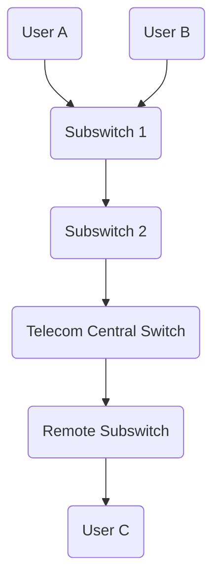
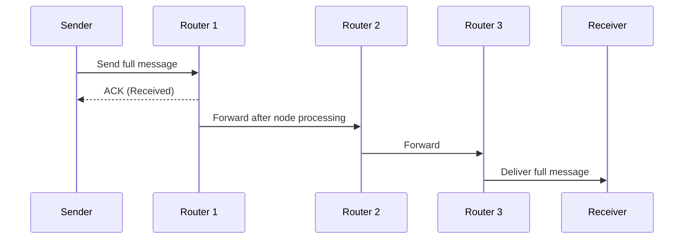
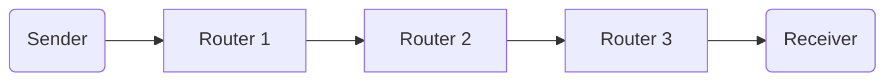
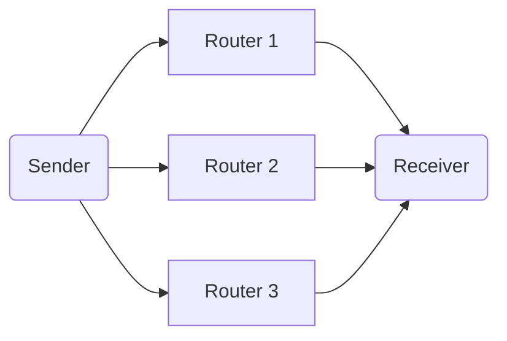

# Lesson 3: Switching — Circuit, Message & Packet (Cell) 🧭

---

## ⚙️ What Is Switching?

When networks grow large, devices cannot all be directly connected — they rely on **switches** to forward data intelligently.
**Switching** is the technique used to decide **how data travels** from source to destination through intermediate nodes.

There are **three major types** of switching:

| Type                        | Generations              | Example                         |
| --------------------------- | ------------------------ | ------------------------------- |
| **Circuit Switching**       | 1st Gen (Analog/Digital) | Telephone Networks              |
| **Message Switching**       | 2nd Gen (Fully Digital)  | Early Store-and-Forward Systems |
| **Packet (Cell) Switching** | 3rd Gen (Digital)        | Modern Internet (TCP/IP, ATM)   |

---

## 🔌 Circuit Switching

### 🧩 Concept

A **dedicated path (circuit)** is established between sender and receiver **before** communication starts.
This circuit remains reserved for the entire duration of the session — like a private lane.

Used originally in **landline telephony**.

---

### 🧠 How It Works

1. User A dials User C.
2. The signal passes through local **subswitches**.
3. Switches coordinate to **reserve** a continuous electrical path.
4. Once connected, analog signals (voice) flow directly until one party hangs up.

---

### 🧰 Variants

| Type                          | Description                                                        |
| ----------------------------- | ------------------------------------------------------------------ |
| **Analog Circuit Switching**  | Physical electrical connections; mechanical relays close circuits. |
| **Digital Circuit Switching** | Logical switching using electronic boards; no moving parts.        |

---

### ⚠️ Limitations

| Issue                       | Explanation                                                                           |
| --------------------------- | ------------------------------------------------------------------------------------- |
| **Setup Time**              | A path must be found and reserved before transmission begins — causing delay.         |
| **Busy Line**               | If all circuits on a route are occupied, new calls are blocked (no alternative path). |
| **Inefficient Utilization** | Even when no data is being sent (pauses in conversation), the line remains reserved.  |
| **High Cost**               | Each active circuit requires dedicated resources.                                     |

> 🧠 Think of circuit switching as *booking a private train track* for two cities — even if no train is currently running, no one else can use it.

---

## 💬 Message Switching

### 🌐 Concept

Here, the **entire message** is treated as one big unit (a “block”).
Each node receives the **whole message**, **stores it**, and then **forwards it** — known as **store and forward**.

No dedicated circuit is established.

---

### 🗺️ Simplified Flow

---

### 🧮 Timing Visualization (as described in class)

| Time (ms) | Event                                   |
| --------- | --------------------------------------- |
| 0         | Sender sends message                    |
| 5         | Router 1 receives it                    |
| 6         | Router 1 forwards it (after processing) |
| 12        | Router 2 receives it                    |
| 14        | Router 2 forwards it                    |
| …         | continues until receiver                |

Each router introduces a small **node processing time** — for routing decisions and interface selection.

---

### 🔁 Acknowledgment Variant

* **Method A:** Simple store-and-forward — no acknowledgment.
* **Method B:** Each router sends **ACK/NACK** back to the previous node, confirming receipt.

  * Ensures reliability.
  * But increases total transmission time.

---

### ⚙️ Node Processing Time

Every intermediate device (router) needs time to:

1. Inspect the header.
2. Decide which **output interface** to use.
3. Queue the message for transmission.

This delay ensures correct delivery, but adds latency at each hop.

---

### 🚫 Problems with Message Switching

| Problem                    | Description                                                                                     |
| -------------------------- | ----------------------------------------------------------------------------------------------- |
| **Variable Message Size**  | Routers must store entire messages; if too large, buffers overflow.                             |
| **High Delay**             | Each hop must *completely* receive the message before forwarding.                               |
| **Inefficient Under Load** | When many large messages exist, routers get congested — some paths become unusable.             |
| **Unpredictable Routing**  | Sender and receiver don’t know the exact path; intermediate policy may change routing behavior. |

> 🧩 Message switching is *reliable but slow*. Think of it like mailing whole letters — each post office must receive and repackage the full letter before passing it on.

---

## 📦 Cell (Packet) Switching

### 🌟 Evolution

To overcome the inefficiencies of message switching, data is divided into **small fixed-size units** called **cells** or **packets**.
Each packet travels independently or semi-independently through the network.

Two main models exist:

1. **Virtual Circuit (VC) Switching**
2. **Datagram Switching**

---

## 🔄 Virtual Circuit (VC) Switching

### 💡 Concept

A temporary **logical path** (not physical) is established before sending data — similar to a “session.”
This is the *virtual* version of circuit switching.

---

### 🧭 How It Works

1. A **VC setup cell** (empty) is sent from sender → receiver.
2. It records the routers and interfaces it passes through.
3. Upon arrival, it returns back along the same path.
4. That **path information** is stored and used by all subsequent data cells.

Each data cell carries:

* **VC ID** – identifies the virtual circuit.
* **Sequence Number** – ensures correct ordering.

---

### 🔗 Diagram

> Once the VC path is set up, all packets follow the **same route**, ensuring ordered delivery.

---

### ✅ Pros

* Predictable path and delay.
* Easy sequencing and reassembly.
* Efficient routing (no repeated decision-making).

### ❌ Cons

* Requires setup time before transmission.
* If one router on the path fails → the entire VC breaks.

---

## 🗺️ Datagram Switching

### 💬 Concept

Each packet (cell) is **independent**.
There is **no setup phase** — every packet carries full destination information and finds its own path.

---

### 🔀 How It Works

Each router decides the best route dynamically based on network conditions.

Packets may:

* Arrive **out of order**.
* Take **different paths**.
* Be **reassembled** at the destination using sequence numbers.

---

### ⚖️ Comparison: Virtual Circuit vs. Datagram

| Feature              | Virtual Circuit           | Datagram                 |
| -------------------- | ------------------------- | ------------------------ |
| **Connection Setup** | Required                  | Not required             |
| **Path Consistency** | Same path for all packets | Different paths possible |
| **Reliability**      | Higher (ordered delivery) | Must reorder at receiver |
| **Flexibility**      | Lower (fixed path)        | High (adaptive routing)  |
| **Typical Use**      | ATM, Frame Relay          | Internet (IP)            |

> 🧠 Virtual Circuit = *like a reserved lane*.
> Datagram = *like individual cars each finding their own fastest route*.

---

## 🧮 Summary Table

| Switching Type               | Setup          | Data Unit     | Efficiency | Delay             | Example        |
| ---------------------------- | -------------- | ------------- | ---------- | ----------------- | -------------- |
| **Circuit**                  | Yes (physical) | Continuous    | Low        | Low (after setup) | Telephony      |
| **Message**                  | No             | Full message  | Moderate   | High              | Early networks |
| **Packet / Cell (VC)**       | Yes (logical)  | Fixed packets | High       | Low               | ATM, MPLS      |
| **Packet / Cell (Datagram)** | No             | Fixed packets | Very High  | Variable          | Internet       |

---

## 🧩 Key Takeaways

* **Switching** defines how data moves between nodes.
* **Circuit Switching** is analog, sequential, and reserved.
* **Message Switching** is store-and-forward, fully digital.
* **Cell (Packet) Switching** divides data into smaller chunks for efficient, parallel delivery.
* The **Virtual Circuit** and **Datagram** models form the basis of today’s Internet architecture.

