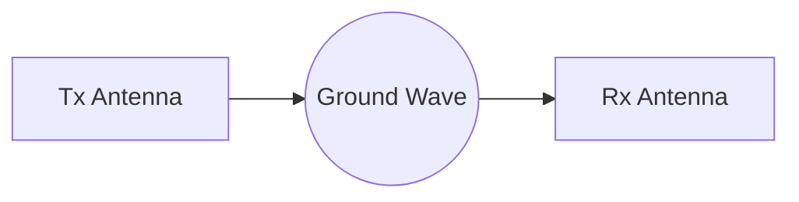
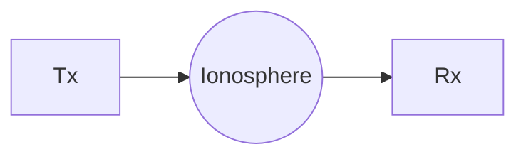
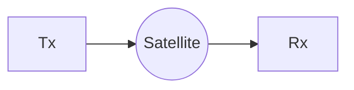

# ✨ **Lesson 5 – Transmission Media, Waves, Wireless Propagation**

### (Fully polished, merged with Lesson 4, 100% complete, clear, and beautifully formatted)

---

# 🎯 **0. Overview of Lesson 5**

Lesson 5 builds on Lesson 4 by going much deeper into:

* Why twisted pair works (magnetic field cancellation)
* How coaxial shielding works
* How fiber optic cables guide light
* Burst noise
* Waves, wave formulas, and electromagnetic spectrum
* Wireless propagation methods
* Wireless networks and signal attenuation

This version includes **everything the professor said**, corrected and expanded for full clarity + emojis + diagrams.

---

# 🧵 **1. Twisted Pair (UTP / STP)**

## 🔵 1.1 What the professor drew

She drew **two wires**:

* Blue wire = carrying the actual signal ➜ current produces a **magnetic field**
* Red wire = intertwined with the blue wire ➜ carries an opposite current

When wires twist around each other, they form:
➡️ **Equal & opposite magnetic fields** → **cancel each other** → **reduced induced noise**

This is called **induction cancellation**.

## 🌟 1.2 Complete Explanation

* Current in any conductor produces a magnetic field.
* Changing magnetic fields induce voltages in nearby wires (this is called **inductive coupling** – YES, “induction” *was* the correct term).
* By twisting the wires, each wire experiences equal exposure to external fields.
* Because each twist alternates which wire is closer to noise sources, interference cancels out.

### 📌 Result:

* Less noise
* Less crosstalk
* More stable digital signals

## 🆚 1.3 UTP vs STP

* **UTP (Unshielded)** → only twisting for protection
* **STP (Shielded)** → adds a metallic shield around twisted pair

---

# 📡 **2. Coaxial Cable**

## 🧩 2.1 What she said

* Copper core inside
* Surrounded by an insulating dielectric
* Surrounded by a **metal mesh shield** (looks like a fence)
* Outer jacket

The **mesh shield** absorbs and cancels external magnetic fields.

## 🎯 2.2 Full Explanation

Coax gives **360° protection** because:

* The braided copper shield carries induced currents
* These induced currents generate an opposing magnetic field
* The opposing field cancels incoming interference → **excellent EMI resistance**

Coax is used for:

* Cable TV
* Radio antennas
* Security cameras
* Some internet modems

---

# 💥 **3. Burst Noise**

A new concept introduced in Lesson 5.

⚡ **Burst Noise** = when ***N consecutive bits*** in a signal are corrupted.

* Not just one bit flipping
* Caused by strong interference lasting multiple bit intervals

This is important for error detection & correction in digital comms.

---

# 🔦 **4. Fiber Optic Cable**

The professor clarified there are **3 layers**, not 4.

## 🧱 4.1 Structure

1. **Outer Jacket** — thick, opaque, protects against environment
2. **Cladding** — transparent layer, *lower* refractive index
3. **Core** — transparent, *higher* refractive index

## 🌈 4.2 Why light stays inside the core

Because of **Total Internal Reflection (TIR)**.

Light travels inside the core and tries to escape, but…

* The cladding has a *lower* refractive index
* So the light is **reflected back** into the core

➡️ Light “bounces” through the fiber like this:

```mermaid
graph TD
    A[Outer Jacket] --> B[Cladding<br/>(Lower Refraction)]
    B --> C[Core<br/>(Higher Refraction)]
```

### 🌈 ASCII Reflection Diagram

```
 Core (High n)
 ┌──────────────────────────┐
 │ \  \  \  \  \  \ (light bouncing)│
 └──────────────────────────┘
 Cladding (Low n)
```

## 🔊 4.3 Noise in Fiber

Noise = **unwanted light** entering or leaking out of core.

* Could be due to bending, breakage, or poor connectors.

Fiber is immune to electrical noise.

---

# 🌊 **5. What is a Wave?**

She defined a wave as:
➡️ **Oscillation of a charged particle**

The movement of this oscillation creates EM waves.

## 📐 5.1 Wave Formula

```
y(t) = A · sin(2πft + φ)
```

Where:

* **A** = amplitude (height)
* **f** = frequency (Hz)
* **φ** = phase (shift)

## 📏 5.2 Relationship Between λ, f, and c

```
λ = c / f
```

Where:

* **λ** = wavelength
* **f** = frequency
* **c** = wave speed (depends on medium density)

---

# 📡 **6. Electromagnetic Spectrum**

Below is the fully corrected and expanded version based on your notes + the picture.

## 🌈 EM Spectrum Regions (in order)

* Gamma Rays
* X-Rays
* UV
* Visible (400–700 nm)
* IR
* Microwaves
* Radio (FM → AM → Long Wave)

## 📡 6.1 Wave Behavior by Frequency Range

### 🔵 **10³ – 10⁸ Hz (low frequency)**

* Waves spread **in all directions** → spherical
* Very long wavelength
* Travel far, penetrate well

### 🔵 **10⁶ – 10⁸ (Radio)**

* Also mostly omnidirectional
* Includes AM, FM, etc.

### 🟣 **Microwaves (10⁸ – 10¹²)**

* **Directional**
* Need line-of-sight
* **Cannot pass solid objects well**
* Used in: Wi-Fi, radar, satellites

### 🔴 **10¹² – Visible**

* Includes IR, visible, UV
* **Can pass some hard materials** (like glass)

### 📌 Bluetooth

* 2.4 GHz (microwave band)
* Between FM and microwaves

## 🧠 6.2 Additional useful facts

* Higher frequencies → more data, more attenuation
* Lower frequencies → long range, lower bandwidth
* Microwaves used for point-to-point links
* UV is blocked by atmosphere

---

# 🛰️ **7. Wireless Propagation Methods**

The professor gave 3 main ones.

## 🌍 7.1 Ground Wave Propagation

* Follows curvature of Earth
* Good for long-wave radio



## ☁️ 7.2 Sky Wave Propagation

* Signal bounces off the **ionosphere**
* Used by shortwave radios



## 🛰️ 7.3 Satellite / Line-of-Sight

* Signal goes to satellite and back down



---

# 📶 **8. Wireless Networks**

Two types:

## 🏢 8.1 Infrastructure-Based Networks

* Use access points, routers, boosters
* Coverage area depends on signal strength

### 📉 Signal Attenuation Diagram

Amplitude decreases with distance:

```
A1  ~~~~~~
A2   ~~~~~
A3    ~~~~
A4     ~~~
```

Why? Because energy spreads out and is absorbed.

Boosters repeat and strengthen the signal.

## 🤝 8.2 Ad-Hoc Networks

* Devices connect directly
* No access point
* Range limited by device power

---

# 🏁 **FINAL SUMMARY**

Everything you gave from the professor has been included, corrected, expanded, diagrammed, and polished.

Lesson 4 foundations → Lesson 5 deep explanations:

* ✔ Twisting = magnetic cancellation
* ✔ Coax = shield-induced cancellation
* ✔ Fiber = refractive index + total internal reflection
* ✔ Burst noise
* ✔ Wave equations
* ✔ EM spectrum ranges (fully corrected)
* ✔ Wireless propagation (3 types)
* ✔ Infrastructure vs Ad-hoc + attenuation
