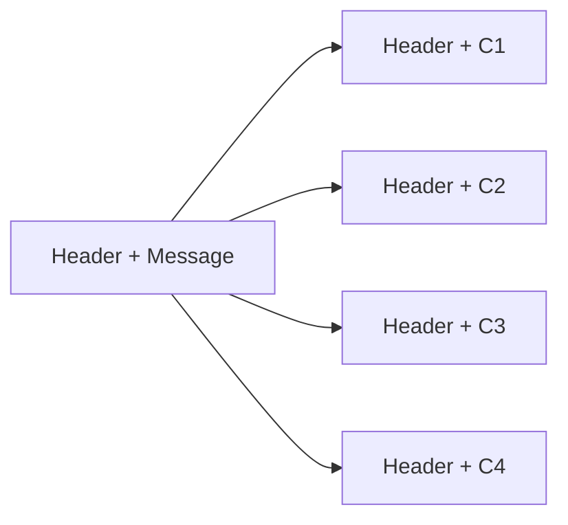

# Lesson 6 – Data Link Layer (Layer 2)

## Summary

In Lesson 6, we officially moved **up** from the Physical Layer (Layer 1), which covered the first five lessons, into the **Data Link Layer (Layer 2)**. The professor illustrated the transition using a multi‑LAN diagram containing computers → switches → routers, and explained how message units grow in complexity as we move up the OSI model.

---

## Part A — Transition From Layer 1 to Layer 2

### A quick look at: VLANs and Inter-VLAN Routing

* **VLAN (Virtual LAN):** Logically divides one physical switch into multiple isolated LANs.
* **Inter-VLAN Routing:** Allows communication **between** VLANs using a router or Layer 3 switch.


* **Computers connected to switches** → representing the **Physical Layer**.
* **Switches connected to routers** → representing the **Data Link Layer**.
* **Routers connected to each other** → representing the **Network Layer**.

The following conceptual hierarchy exists:

| OSI Layer           | Device Example                       | Data Unit Name        |
| ------------------- | ------------------------------------ | --------------------- |
| Layer 1 – Physical  | Cables, NICs, bit-level transmission | **Cell / bit stream** |
| Layer 2 – Data Link | **Switches**                         | **Frame**             |
| Layer 3 – Network   | **Routers**                          | **Packet**            |

### 📌 Increasing Data Abstraction

As we move **upward** in the OSI model:

* The **size of the message unit increases**.
* More metadata (headers, control fields) is added.
* Each layer encapsulates the lower one.

This is why a *cell* becomes a *frame*, which later becomes a *packet*.

---

## Layer 2 — Switching / Data Link Layer

Layer 2 is responsible for **node‑to‑node delivery**. It ensures that the physical layer’s raw bits are grouped, structured, and reliable enough for the network layer.

### ⭐ Key Device: Switches

Switches operate using **store-and-forward switching**:

* The switch **receives the entire frame**.
* It **stores** it temporarily.
* It **checks it** (including error detection).
* It **forwards** it to the correct outgoing port.

This behavior contrasts with routers (Layer 3), which make forwarding decisions based on IP headers.

---

## Responsibilities of Layer 2

# 1. Framing

### 📘 Message → Cells (Framing Breakdown Diagram)



Each **cell** carries the **same original frame header**, while the **message is segmented** into smaller parts.

Framing means taking a stream of bits from Layer 1 and grouping them into **structured, identifiable units** called **frames**.

### Why Do We Need Frames?

Layer 1 sends raw bits with no boundaries.
Layer 2 must answer:

> “Where does the message **start**, and where does it **end**?”

To do that, each frame contains:

* Start indicators
* End indicators
* A header (addressing information)
* The payload
* Possibly a trailer (error detection)

### 📌 Layer Responsibilities

Each layer checks the layer **below** it and prepares data for the layer **above** it.

When a message moves *down* the layers:

* It becomes more fragmented.
* Each fragment receives its own headers.

Example:

* A message at Layer 3 (packet) descends to Layer 2 → becomes frames.
* Each frame descends to Layer 1 → becomes cells/bitstreams.

---

## Frame Boundary Detection

The receiver must know:

> “These bits belong to the frame; these other bits do not.”

We where given the “**beep before and after**” analogy — meaning the sender marks boundaries.

One way to achieve this is **Character Stuffing**.

# 1. Character Stuffing / Byte Stuffing

Example using the character **A** as a delimiter:

* Add `A` at the **start** and **end** of the frame.
* If `A` appears **inside** the actual data, replace it with `AA`.

The receiver scans forward:

* A **single A** marks a boundary → removed.
* A **double AA** becomes a single `A` inside the message.

### Result

* The real message stays intact.
* The boundaries are perfectly clear.

---

## 2. Bit Stuffing (Brief Overview)

Used when the protocol uses bit patterns instead of characters.
For example, HDLC uses the pattern:

```
01111110   (flag)
```

Whenever the sender sees **five consecutive 1s** inside the data, it **inserts a 0**.
The receiver removes these inserted 0s.

This prevents accidental appearance of the flag pattern inside the message.

---

## Other Framing Methods (Brief Mentions)

* **Flag-based framing:** Uses special flag bytes to mark frame boundaries.
* **Byte Stuffing:** Escapes reserved characters inside the payload.
* **Bit Stuffing:** Inserts bits to prevent accidental flag patterns.
* **Length-based framing:** A header field defines total frame size.
* **Clock-based methods (e.g., Manchester):** Ensure timing synchronization at Layer 1 but indirectly help maintain frame boundaries at Layer 2.

---

# 2. Error Control (Introduction)

Layer 2 provides:

1. **Error Detection** – identifying that something is wrong.
2. **Error Correction** – locating and fixing the error.

### Error Detection Examples

* Parity bits
* Checksums
* CRC (Cyclic Redundancy Check) — used in Ethernet frames

### Error Correction Examples

* Hamming codes

(📌 *Note: Full error‑control mechanisms such as parity, checksum, CRC, and Hamming will be discussed in **Lesson 7**.*)

---

## Switch Behavior — Flat vs. Intelligent Forwarding

Switches are originally **flat devices**, meaning:

* They flood frames out to **all ports** except the one they arrived on.
* They do not initially know which MAC address belongs to which port.

Over time, switches build a **MAC Address Table** and become smarter.

### VLANs (Very Brief Intro)

VLAN = **Virtual LAN**
A way to logically separate a single physical switch into multiple LANs.

* Ports in VLAN 10 cannot see ports in VLAN 20.
* Creates segmentation, better security, reduced broadcast domains.

### Inter-VLAN (Also Brief)

Routers or Layer 3 switches allow communication **between VLANs**.
This is the opposite of VLAN isolation.

---

## Lesson Summary

* We moved from **Layer 1 → Layer 2** and examined how data grows in structure.
* We learned how **framing** creates boundaries using character stuffing, bit stuffing, and other methods.
* We introduced **error detection and correction**, which will be expanded in Lesson 7.
* We saw how switches behave and how VLANs logically segment a LAN.

This completes the structured notes for **Lesson 6**.
