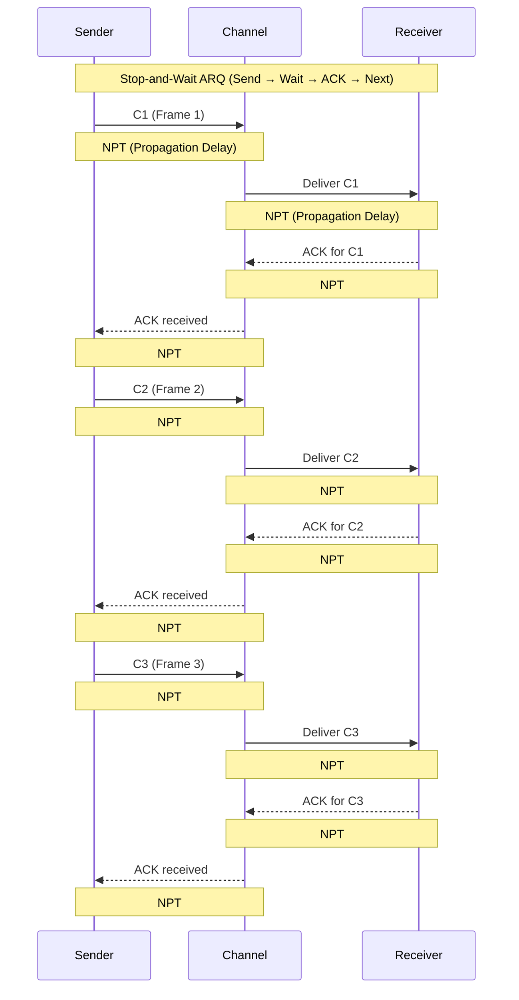
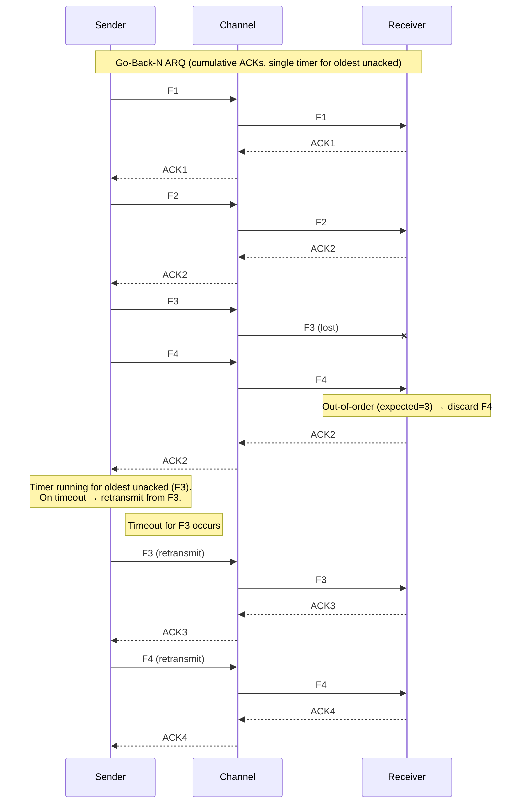
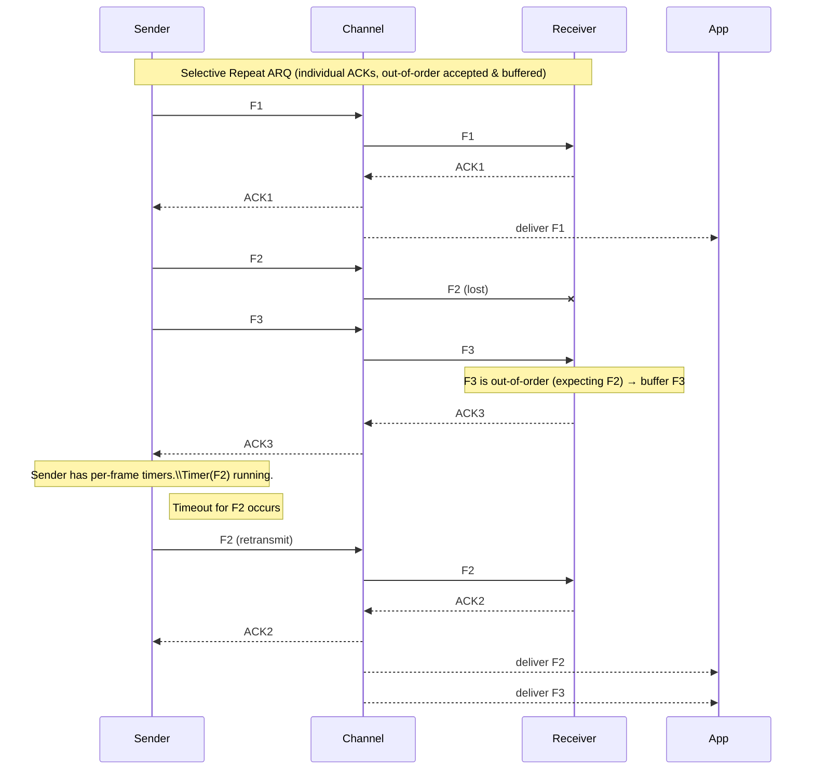
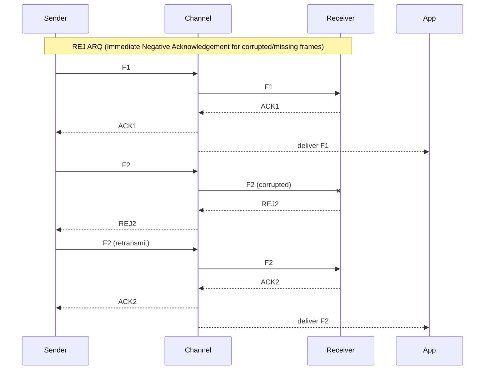

# Lesson 7B – Flow Control Full Breakdown

📝In **Part B**, we shift our focus to **flow control**, exploring what it is, why it matters, and how real systems use it.
Below are the four major ARQ (Automatic Repeat reQuest) protocols used for error control in data communication, followed by the Sliding Window mechanism that powers Go-Back-N and Selective Repeat.

---

# 1. Stop-and-Wait

**Idea:** Send one frame at a time and wait for an acknowledgment before sending the next.

**How it Works:**
- Sender transmits a single frame.
- Waits for an ACK from the receiver.
- If no ACK arrives within the timeout, the sender retransmits the same frame.

**Pros:**
- Very simple to implement.
- Reliable delivery.

**Cons:**
- Channel remains idle while waiting for ACK.
- Very inefficient for long-distance or high-latency links.

### **Mermaid Diagram**

### 📊 Timing Table for Stop-and-Wait
| Step | Approx. Time | Description |
|------|--------------|-------------|
| 1 | 0 ms | 📤 Sender transmits Frame C1 |
| 2 | 5 ms | ⏳ C1 travels through channel (Propagation Delay) |
| 3 | 10 ms | ✔️ Receiver gets C1 and sends ACK for C1 |
| 4 | 15 ms | ⏪ ACK returns to Sender |
| 5 | 20 ms | 🔁 Sender sends next frame C2 | 

### 🔑 Important Notes
- Sender transmits **one frame at a time**.
- Waits for **ACK** before sending the next one.
- If ACK is lost or delayed, sender **retransmits after timeout**.
- Easy to implement but **low efficiency** for long propagation delays.

---

# 2. Go-Back-N

**Idea:** Transmit multiple frames using a window, but if an error occurs, resend the erroneous frame and all frames after it.

**How it Works:**
- Sender can send up to *N* frames without waiting for ACKs.
- Receiver only accepts frames in order.
- If a frame is lost or corrupted, receiver discards it and all subsequent frames.
- Sender retransmits that frame and all following frames.

**Pros:**
- Much more efficient than Stop-and-Wait.
- Channel stays busy.

**Cons:**
- Wastes bandwidth when one error forces multiple retransmissions.
- Cannot use out-of-order frames.

### **Mermaid Diagram**

### 📊 Timing Table — Go-Back-N ARQ

| Step | Time | Description |
|------|------|-------------|
| 1 | 0–5 ms | 🚀 Sender transmits F1–F4 within its window. |
| 2 | ~1–3 ms | 📬 Receiver gets **F1**, sends **ACK1** (cumulative). |
| 3 | ~2–4 ms | 📬 Receiver gets **F2**, sends **ACK2** (next expected = 3). |
| 4 | ~3–5 ms | ❌ **F3 is lost** in the channel. |
| 5 | ~4–6 ms | ⚠️ Receiver gets **F4**, but expected F3 → **discard F4**, send **duplicate ACK2**. |
| 6 | ~6–Ttimeout | 🔁 Sender keeps receiving duplicate ACK2 → knows something is missing but **does NOT retransmit yet**. |
| 7 | Ttimeout | ⏳ Timeout for **oldest unacked (F3)** → **retransmit F3, F4…** |
| 8 | After timeout | ✔️ Receiver gets F3 → ACK3, then F4 → ACK4. Normal flow resumes. |

### 🔑 Important Notes
> **Textbook Go-Back-N does *not* normally use explicit NACKs.**  
> When a frame is missing, the receiver sends **duplicate/cumulative ACKs** for the last in-order frame (e.g., ACK2).  
> The sender detects the loss through **timeout**, not through NACK.

---

# 3. Selective Repeat

**Idea:** Only the specific frames that were lost or corrupted are retransmitted.

**How it Works:**
- Sender transmits multiple frames using a sliding window.
- Receiver accepts out-of-order frames and stores them.
- Missing frames are explicitly requested again.
- Sender retransmits only the frames that were lost.

**Pros:**
- Highly efficient.
- Minimizes retransmission overhead.
- Ideal for noisy or high-latency networks.

**Cons:**
- More complex implementation.
- Requires out-of-order buffering.

### **Mermaid Diagram**

### 📊 Timing Table — Selective Repeat ARQ

| Step | Time | Description |
|------|------|-------------|
| 1 | 0–5 ms | 🚀 Sender transmits F1, F2, F3 (within window). |
| 2 | ~1–3 ms | 📬 Receiver gets **F1** → ACK1, deliver to app. |
| 3 | ~2–4 ms | ❌ **F2 is lost** in channel (never reaches R). |
| 4 | ~3–5 ms | 📬 Receiver gets **F3** → **buffer** F3 (out-of-order), send **ACK3**. |
| 5 | ~TF2 | ⏳ Timer for **F2** expires at sender → **retransmit F2 only**. |
| 6 | after retransmit | ✔️ Receiver gets F2 → ACK2; then deliver F2 and buffered F3 to application. |

### 🔑 Important Notes
- **Selective Repeat uses individual ACKs** and **per-frame timers**; the sender retransmits **only** the missing frame(s).  
- **NACKs are optional**: some implementations use explicit NACKs, but textbook Selective Repeat commonly relies on ACKs + per-frame timeouts.  
- Receiver must **buffer** out-of-order frames (up to window size) to later deliver them in order to the application.

---

# 4. Reject (REJ) ARQ

**Idea:** Receiver sends an immediate reject (REJ) message when a frame is detected as erroneous.

**How it Works:**
- Upon detecting a faulty frame, receiver sends **REJ(i)** indicating which frame needs retransmission.
- Sender retransmits only that specific frame.
- Simpler than Selective Repeat but more precise than Go-Back-N.

**Pros:**
- Fast error notification.
- Only the incorrect frame is resent.

**Cons:**
- Requires immediate error detection.
- Typically does not support out-of-order buffering.

### **Mermaid Diagram**

### 📊 Timing Table — REJ ARQ

| Step | Time | Description |
|------|------|-------------|
| 1 | 0–2 ms | 🚀 Sender transmits F1 → Receiver gets F1 → ACK1 → delivered to application. |
| 2 | 2–4 ms | ❌ F2 is **corrupted** in channel. Receiver immediately sends **REJ2**. |
| 3 | 4–6 ms | ⏳ Sender receives REJ2 → **retransmits F2**. |
| 4 | 6–8 ms | ✔️ Receiver gets F2 → ACK2 → delivered to application. |

### 🔑 Important Notes
- REJ ARQ uses **immediate negative acknowledgements**: the receiver signals **exactly which frame** was missing or corrupted.  
- The sender **retransmits only the rejected frame**, not all subsequent frames.  
- Out-of-order frames are **discarded**; buffering is not used in basic REJ ARQ.  
- Timers are typically **per window**; retransmission occurs **immediately on REJ receipt**.

---

# Sliding Window Mechanism (Underlying Concept)
**Note:** This is *not* an ARQ protocol, but the mechanism powering:
- Go-Back-N ARQ
- Selective Repeat ARQ

**Idea:** Allow multiple frames to be sent and acknowledged efficiently using send and receive windows.

**Key Concepts:**
- Sender maintains a sending window that determines how many frames can be in transit.
- Receiver maintains a receiving window that defines which frames it can accept.
- As ACKs arrive, the window slides forward, enabling continuous transmission.

**Why It Matters:**
- Maximizes link utilization.
- Reduces idle time.
- Essential for modern high-speed networks.
  
---

## 🧠 Final Summary Table
This comparison table gives you a quick study reference.

| Protocol | Window Size | Receiver Behavior | Retransmission Strategy | Efficiency | Complexity |
|----------|-------------|-------------------|--------------------------|------------|------------|
| 🟦 Stop-and-Wait | 1 frame | Accept only one frame at a time | Resend after timeout | Low | Very Low |
| 🟩 Go-Back-N | N frames | Accept in-order only; discard out-of-order | Resend from first missing frame onward (cumulative ACKs, timeout) | Medium | Low–Medium |
| 🟨 Selective Repeat | N frames | Accept out-of-order & buffer | Resend only missing frames (individual ACKs, per-frame timers) | High | Medium–High |
| 🟥 REJ (Reject) | 1 frame | Accept only in-order; discard out-of-order | Resend rejected frame immediately (upon REJ) | Medium | Low |
| 🟪 Sliding Window | Adaptive | Depends on ARQ variant | Moves window based on ACK/NACK | Very High | Medium–High |

---
📝 **Note:** 
- NPT = Network Propagation Time, representing the delay between Sender → Channel → Receiver and back.
- ARQ = Automatic repeat request (ARQ), also known as automatic repeat query, is an error-control method for data transmission that uses acknowledgements (messages sent by the receiver indicating that it has correctly received a message) and timeouts (specified periods of time allowed to elapse before an acknowledgment is to be received).
---
