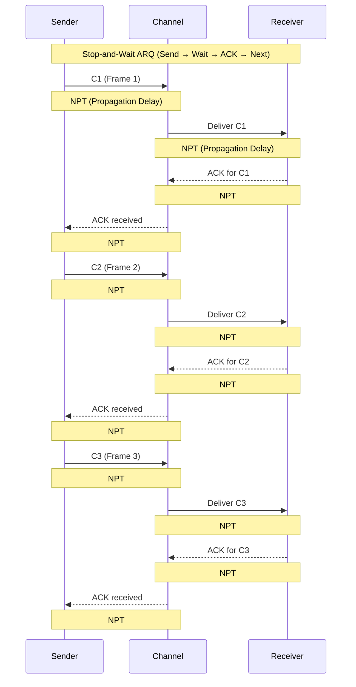
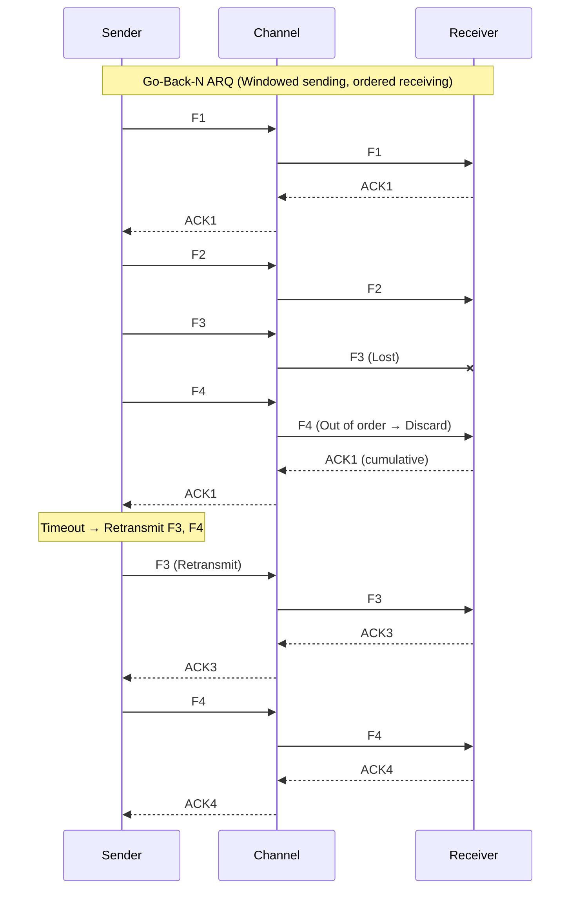
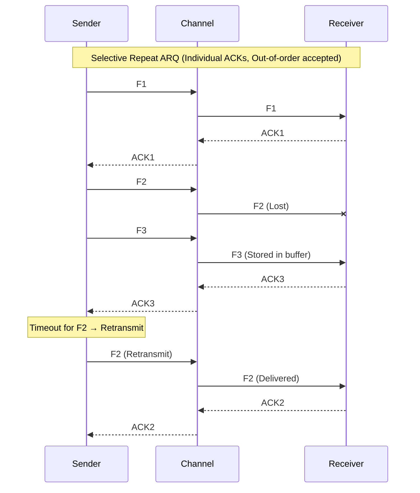
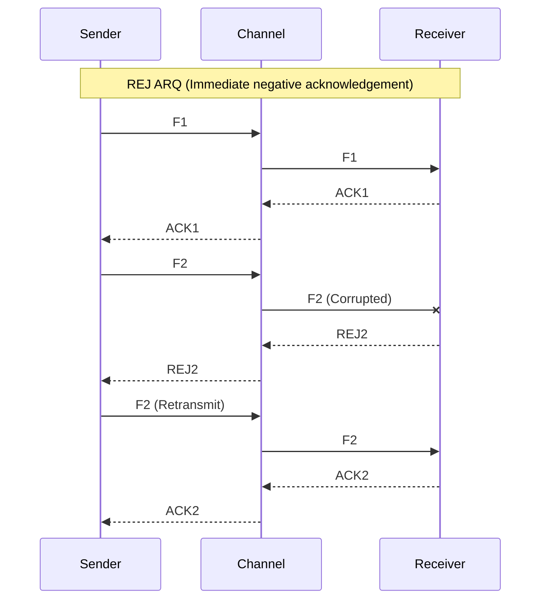
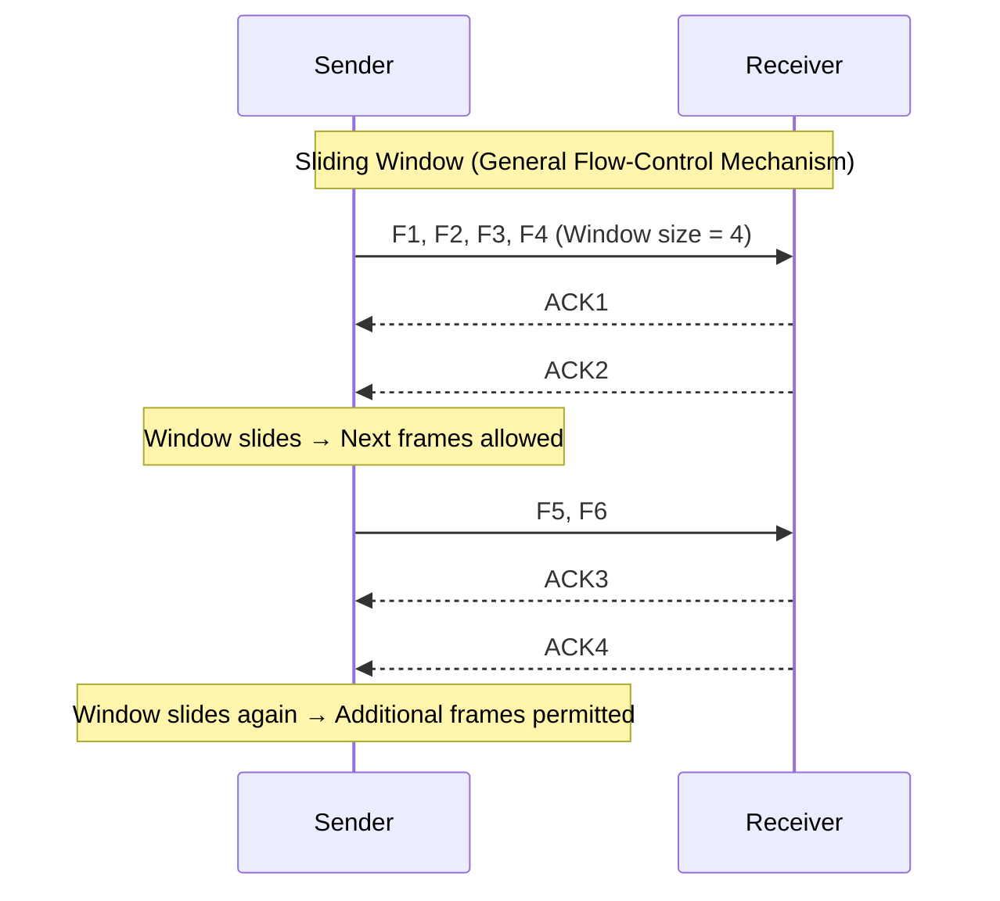

# Lesson 7B – Flow Control Full Breakdown

## Automatic Repeat Request (ARQ) Protocols — Full Lesson Notes

Below are complete, clean class-style notes for all ARQ mechanisms discussed in Lesson 7 Part B, including fully formatted Mermaid diagrams. You can copy this entire Markdown file directly into GitHub.

---

# 1. Stop-and-Wait

### 📘 Detailed Explanation
Stop-and-Wait ARQ is the simplest form of flow and error control. In this method, the sender sends **one frame at a time** and then *waits* for an acknowledgment (ACK) before sending the next one. This ensures reliability because the sender always knows whether the receiver successfully got the frame. However, it’s slow because the medium stays idle while waiting for ACKs. If the sender doesn’t receive an ACK within a timeout period, it **retransmits** the same frame. This prevents data loss but reduces efficiency on long-distance or high-latency networks 🌍.

### 📊 Timing Table for Stop-and-Wait
| Step | Approx. Time | Description |
|------|--------------|-------------|
| 1 | 0 ms | Sender transmits Frame C1 📤 |
| 2 | 5 ms | C1 travels through channel (Propagation Delay) ⏳ |
| 3 | 10 ms | Receiver gets C1 and sends ACK for C1 ✔️ |
| 4 | 15 ms | ACK returns to Sender ⏪ |
| 5 | 20 ms | Sender sends next frame C2 🔁 | ARQ

### **Concept Summary**
- Sender transmits **one frame at a time**.
- Waits for **ACK** before sending the next one.
- If ACK is lost or delayed, sender **retransmits after timeout**.
- Easy to implement but **low efficiency** for long propagation delays.

### **Mermaid Diagram**

---

# 2. Go-Back-N

### 📘 Detailed Explanation
Go-Back-N improves upon Stop-and-Wait by allowing the sender to transmit **multiple frames in a row** without waiting for ACKs, up to the size of the *sender window*. Frames are labeled with sequence numbers, and the receiver only accepts them **in order**. If a frame is lost or corrupted, the receiver rejects it (implicitly by silence or NACK), and the sender must **go back** and retransmit that frame *and all frames after it*. This ensures order but wastes bandwidth when errors occur 🌐.

### 📊 Timing Table for Go-Back-N
| Step | Time | Description |
|------|------|-------------|
| 1 | 0–5 ms | Sender transmits Frames C1, C2, C3… without waiting 🚀 |
| 2 | 6 ms | Receiver detects C2 is missing ❌ |
| 3 | 7 ms | Receiver sends NACK or stays silent ⚠️ |
| 4 | 10 ms | Sender retransmits **C2, C3, …** in order 🔄 | ARQ

### **Concept Summary**
- Sender can send **N frames** without waiting (window size = N).
- Receiver only accepts **in‑order** frames.
- If a frame is lost/damaged, **receiver discards everything after it**.
- ACK is cumulative → ACK(k) = "all frames up to k received".
- If timeout occurs for frame *i*, sender retransmits **frame i and all after it**.

### **Mermaid Diagram**

---

# 3. Selective Repeat

### 📘 Detailed Explanation
Selective Repeat (Selective Reject) ARQ is a more advanced version of Go-Back-N. Instead of throwing away all frames after a missing one, the receiver accepts **out-of-order frames**, buffers them, and only requests **the specific missing frame**. This dramatically reduces retransmission overhead and improves efficiency, especially on long links or in noisy environments 🌐⚡. However, this method requires more complex buffering and tracking on both sides.

### 📊 Timing Table for Selective Repeat
| Step | Time | Description |
|------|------|-------------|
| 1 | 0–5 ms | Sender transmits C1, C2, C3, C4… 📤 |
| 2 | 6 ms | Receiver gets C1, C3, C4 — C2 missing ❗|
| 3 | 7 ms | Receiver sends NACK for C2 only 🎯 |
| 4 | 10 ms | Sender retransmits **C2 only** 🔁 |
| 5 | 12 ms | Receiver reorders C1, C2, C3, C4 ✔️ | ARQ

### **Concept Summary**
- Sender and receiver both maintain **sliding windows**.
- Receiver **accepts out‑of‑order frames**.
- Only **incorrect/missing** frames are retransmitted.
- Each frame has its own ACK.

### **Mermaid Diagram**

---

# 4. Reject (REJ) ARQ

### **Concept Summary**
- Variation of Selective Repeat.
- Receiver sends **REJ(n)** when frame *n* is missing or corrupted.
- Sender retransmits **only frame n** immediately.
- Faster than timeout‑based recovery.

### **Mermaid Diagram**

---

# 5. Sliding Window

### 📘 Detailed Explanation
Sliding Window is the general mechanism that powers both Go-Back-N and Selective Repeat. The sender maintains a **window** of frames it is allowed to send without waiting for ACKs, while the receiver maintains a window of frames it expects to receive. As ACKs arrive, the sender’s window **slides forward**, enabling continuous transmission and improving efficiency 🚀.

### 📊 Timing Table for Sliding Window
| Step | Time | Description |
|------|------|-------------|
| 1 | 0–10 ms | Sender transmits full window of frames (W frames) 📤 |
| 2 | 5–15 ms | Receiver acknowledges frames as they arrive 📨 |
| 3 | 15 ms | Window slides, freeing spots for more frames ↔️ |
| 4 | 20+ ms | Lost frames → NACK/timeout → targeted or bulk retransmission 🔄 | Protocol (General Model)

### **Concept Summary**
- Sender maintains a window of frames it can transmit without waiting.
- Receiver maintains a window of acceptable frame sequence numbers.
- ACKs slide the window forward.
- Two main variants:
  - **Go‑Back‑N** (only in‑order acceptance)
  - **Selective Repeat** (buffer out‑of‑order)

### **Mermaid Diagram**

---

## End of Lesson 7 Part B Notes

## 🔍 Expanded Explanations for All ARQ Protocols

### 🟦 Stop-and-Wait ARQ — Expanded Explanation
Stop-and-Wait ARQ is the simplest form of flow and error control. In this protocol, the sender transmits **a single frame at a time** and then halts transmission until it receives an acknowledgement (ACK) from the receiver. This mechanism ensures that the sender does not overwhelm a slow receiver since it waits for feedback before proceeding. However, the downside is that the channel remains idle during this waiting time, making the protocol inefficient on high-latency networks. If the sender does not receive an ACK within a specified timeout period, it assumes the frame is lost and retransmits it. This guarantees reliability but sacrifices efficiency 🚦.

### 🟩 Go-Back-N ARQ — Expanded Explanation
Go-Back-N improves efficiency by allowing the sender to transmit **multiple frames before receiving ACKs**, up to a value called the **window size (N)**. Frames are numbered sequentially, and the receiver only accepts them in order. If a frame is lost or corrupted, the receiver discards that frame and all subsequent ones—even if they were delivered correctly. It then sends a **negative acknowledgement (NACK)** or simply remains silent. The sender then “goes back” and retransmits that frame and all frames after it. This system maintains order while being more efficient than Stop-and-Wait but can waste bandwidth when errors occur 📡.

### 🟨 Selective Repeat / Reject ARQ — Expanded Explanation
Selective Repeat (or Selective Reject) ARQ further improves efficiency by letting the receiver **accept and buffer out-of-order frames**. Unlike Go-Back-N, the receiver does *not* discard everything after a lost frame. Instead, only the missing frame is negatively acknowledged, and only that specific frame is retransmitted. This reduces retransmission overhead and maximizes the use of high-bandwidth links. However, it requires more complex buffering on both sender and receiver sides, as they must keep track of which specific frames were acknowledged and which were not 🎯.

### 🟥 Sliding Window Protocol — Expanded Explanation
Sliding Window is the generalized mechanism behind Go-Back-N and Selective Repeat. It defines how many frames the sender is allowed to transmit without receiving ACKs (the **window size** 🚪). As ACKs arrive, the sender's window “slides forward,” allowing new frames to enter the pipeline. The receiver also maintains a window of what it is willing to accept. ACKs and NACKs dynamically adjust this window by freeing buffer space or signaling for retransmission. This technique maximizes link utilization and ensures robust flow control across a variety of network conditions.

---

## 📊 Table: Timing & Behaviour Explanation for the Diagrams
Here is a simple reference table to help interpret the flow in each diagram. Times are conceptual (not exact network timings) and illustrate the sequence of events.

| Step | Approx. Time | Event Description |
|------|--------------|------------------|
| 1 | 0 ms | Sender transmits Frame C1 📤 |
| 2 | 5 ms | Frame C1 propagates through the channel (NPT) ➡️ |
| 3 | 10 ms | Receiver gets C1 and sends ACK 🔁 |
| 4 | 15 ms | ACK travels back through channel (NPT) ➡️ |
| 5 | 20 ms | Sender receives ACK and sends next frame 📤 |
| 6 | 25–30 ms | Same propagation-ACK cycle repeats for C2, C3, ... 🔄 |

📝 **Note:** NPT = Network Propagation Time, representing the delay between Sender → Channel → Receiver and back.

---

## 🧠 Final Summary Table
This comparison table gives you a quick study reference.

| Protocol | Window Size | Receiver Behavior | Retransmission Strategy | Efficiency | Complexity |
|----------|-------------|-------------------|--------------------------|------------|------------|
| 🟦 Stop-and-Wait | 1 frame | Accept only one frame at a time | Resend after timeout | Low | Very Low |
| 🟩 Go-Back-N | N frames | Accept in order only | Resend from first missing frame onward | Medium | Low–Medium |
| 🟨 Selective Repeat | N frames | Accept out-of-order & buffer | Resend only missing frames | High | Medium–High |
| 🟥 Sliding Window | Adaptive | Depends on ARQ variant | Moves window based on ACK/NACK | Very High | Medium–High |

---
